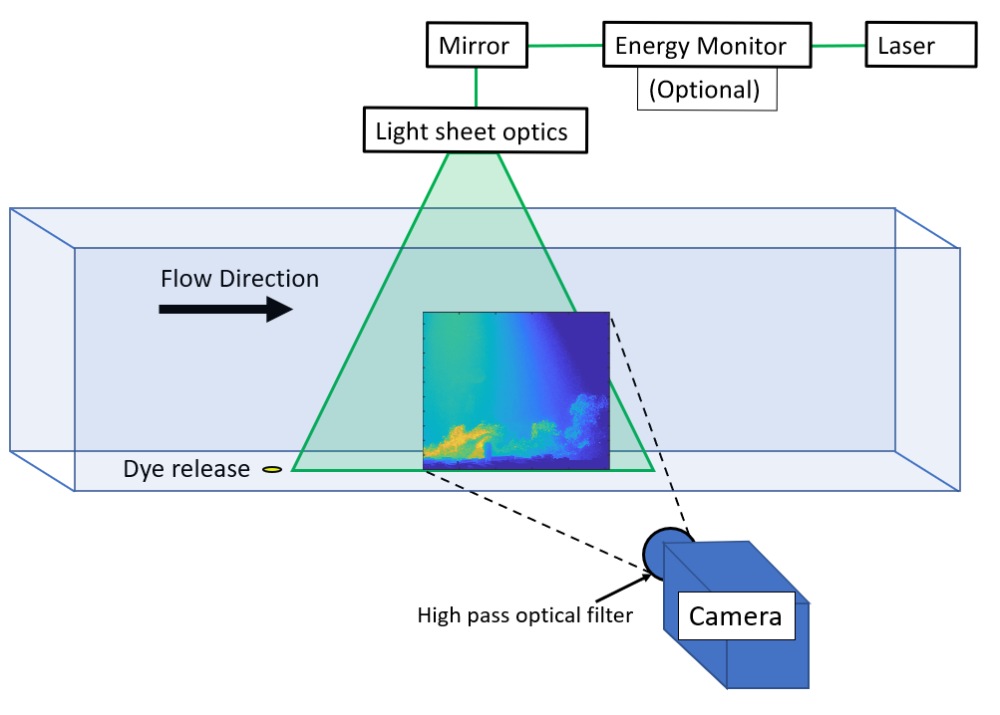
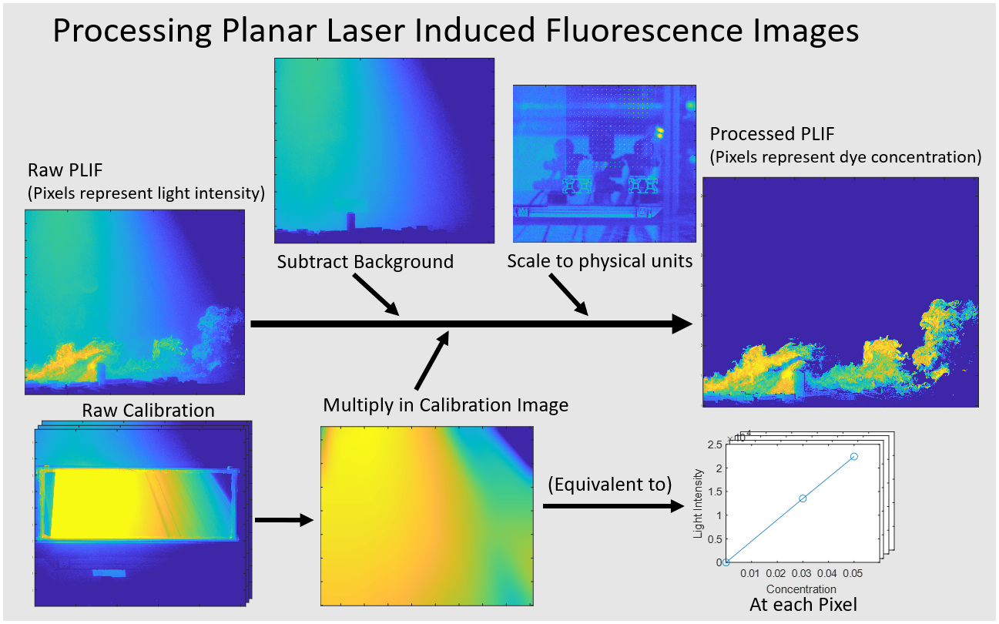

# Summary

Planar laser induced fluorescence (PLIF) is a technique used to quantitatively measure the concentration of a fluorescent species in a flow. This paper and code are specifically designed for aqueous applications in which a fluorescent dye is illuminated by a planar laser sheet. A camera measures the intensity of fluorescence, which this code uses to calculate the concentration of dye. A multiple step calibration is required using a set of specific calibration images. This process calibrates both the geometric (pixel to mm) scale and the transfer function to map the measured fluorescent intensity to the local dye concentration. Biases can be introduced from background dye build-up or laser attenuation. This code package is designed to allow the user to account for these biases using tunable parameters based on experimental measurements and additional calibration images.

# Statement of need

The applications of experimental concentration measurements in a fluid flow are extensive. Some examples include urban flows, (Lim2022)(Karra2017), turbulent jets (Milton-McGurk2020), dispersion over roughness (Djenidi2008), and dispersion within boundary layers (Tomas2017). When attempting to map these varied experimental cases it is valuable to be able to measure dispersion across full planes, as opposed to using point measurements. 

 

In order to carry out a PLIF investigation it is necessary to have a large amount of specialised equipment (see \autoref{diagramexpl}) and also to have a complex post processing code along with the expertise to use it.  It is possible to run a PLIF investigation without all of the tools recommended to reduce uncertainty. For example a laser energy monitor can be disregarded; uncertainty will rise but PLIF is still possible. The same is true of a specialised PLIF camera with a high pixel depth. The form of PLIF that this code is designed for is known as aqueous PLIF, and this is the form that is typically used for non-reactive flows. Having a water-based experimental facility is a significant barrier to entry to carrying out aqueous PLIF. It is hoped that by releasing this software package as an open source tool, lack of post-processing software will be removed as one of these many barriers to entry.

This PLIF calibration package is a set of MATLAB tools that enable the user to process PLIF datasets. Concentration calibration images are images in which a tank of dye of a known concentration is introduced into the experimental setup, in order to record image intensity values that relate to known concentration values. Attention was drawn (Vanderwel 2014)(Crimaldi 2008) to the necessity to correct concentration calibration images, as they themselves can create a bias that is not present to the same degree in experimental images. This bias being the higher level of attenuation along laser rays present in the dye tanks than happens in the free stream of the experiment. If not corrected for then this biases the experiment to be more sensitive to dye near the laser sheet source. This problem was addressed by (Baj 2016) in a novel way using the traversal of a narrow tank, however it is possible to account for this problem more simply through the calculation of absorptivity ($\varepsilon$). This software package provides checks along the processing steps that it is working as intended in the form of graphs and images of the calibration steps. This package is primarily intended for academic research use.

# Package Overview

The functions in this package are designed to be run through a main function. In this package, an example of a main function is included (example.m). The functions are designed to generate a calibration matrix and save that to a file. This calibration matrix is an array of multipliers that correspond to each pixel in an image and are later multiplied in. These multipliers represent the gradient between measured intensity and dye concentration at each point in the flow. The background subtraction represents a zero offset for this gradient, and is subtracted before the scale is applied. The \textit{calculate calibration} and \textit{apply calibration} sections of this code are designed to be independently executable.

 

\autoref{calexpl} shows the process of a PLIF calibration in diagram form. Example inputs and outputs are taken from an investigation into urban air pollution that was carried out at the University of Southampton.
The equation for fluorescent emittance,

$$
\label{flemit}
E=aI(C-b)
$$
\begin{center}
\scriptsize
Equation for fluorescent emittance, where E is the emittance, a is a calibration
constant, I is the light intensity, C is the dye concentration, and b is the background intensity.
\normalsize
\end{center}

is used in the process described by \autoref{calexpl}. Conducting this full pixel by pixel calibration shown in \autoref{calexpl} allows the constant (a) and the light intensity (I) to be accounted for, so that the concentration (C) can be quantitatively calculated using the emittance (E). The high pass filter shown in \autoref{diagramexpl} is necessary in order to eliminate the camera's ability to measure intensity at the absorption wavelength of the dye (I). Without taking this step the assumption that all light measured by the camera is only that which is emitted by the dye (E) is invalid, and instead (E+I) is what would be measured. In the code the first step is the background subtraction (removing b in the equation). The calibration image is then generated from the gradient of the line of pixel intensity against dye concentration, in the equation for fluorescent emittance it is equivalent to a pixel by pixel value of $1/aI$. After this step the raw image has been transformed from an array of pixels representing measured fluorescent emittance, to one representing scalar concentration. In order to calibrate an accurate value of the light intensity (I) at each pixel, the attenuation through the calibration tank must be accounted for. This is done using the Beer-Lambert law. 

$$
\label{bl}
A=\varepsilon bC
$$
\begin{center}
\scriptsize
The Beer-Lambert law, where A is absorbance, $\varepsilon$ is absorptivity, b is path length, and C is concentration.
\normalsize
\end{center}

In the case of a calibration image the concentration (C) and ($\varepsilon$) are constant, and b is constant but has a different value at each pixel. The definition of absorbance (A) can be used

$$
\label{blrea}
A=I_{x}-I_{y}
$$
\begin{center}
\scriptsize
A is equal to Absorbance, $I_{x}$ is light intensity at x, and $I_{y}$ is light intensity at y.
\normalsize
\end{center}

to obtain another equation referring to absorbance in terms of light intensity. These two can be rearranged to obtain an equation in which ($\varepsilon$) is the only unknown. 

$$
\label{epsilon_eq}
I_{x}-I_{y} = \varepsilon rC
$$
\begin{center}
\scriptsize
A rearrangement of the Beer Lambert law. $I_{x}$ is light intensity at x, $I_{y}$ is light intensity at y, $\varepsilon$ is absorptivity, r is path length between a and b, and c is concentration.
\normalsize
\end{center}

This equation can be solved at each pixel of each calibration image in order to create an image which is analagous to each row of pixels being illuminated as if they were the top row closest to the laser. This removes the problem of high attenuation during the calibration process, and gives an accurate estimation of the light intensity (I). This method is dependent on having an accurate estimate of the absoprtivity ($\varepsilon$). Methods to calculate the absorptivity $\varepsilon$ of a solution vary. This software package includes a package of code to iteratively calculate this from the calibration images. This process mostly uses the existing code and is designed to be optional. This would be represented in \autoref{calexpl} by a repeating loop of the bottom row, in which the calibration image is generated. This loop runs until the light intensity ratios measured from the calibration tanks match the ratios of dye concentrations within them, and it can be configured to prioritize a specific region of the image for optimization.

# Package Functions

Below is a list of all the functions included in the package:

\Large \bf{PLIF Calibration functions - }
\normalsize
\begin{enumerate}

    \item Average - calib\_calculate\_coefficients : Parent function that calls other calibration functions.
    
    \item Average - calib\_average\_frames : A function to average the sets of images used for each calibration tank position.
    
    Input: 7 sets of calibration images
    
    Output: 7 averaged calibration images
    
    \item Merge - calib\_merge\_frames : A function to merge the 3 tank positions for each dye concentration. The background image does not need merging.
    
    Input: 2 sets of 3 averaged calibration images
    
    Output: 2 merged calibration Images
    
    \item Trace Rays - calib\_trace\_rays : A function requiring user input to calculate the laser origin based on visible laser lines in the calibration images. In this step sections of the image can also be selected to be deleted and interpolated. 
    
    Input: Laser streak locations.
    
    Output: Laser Source coordinates.
    
    \item Correct Attenuation - calib\_correct\_attenuation : Application of attenuation correction using molar apsorptivity(Epsilon), laser source location, and out of frame tank height.
    
    Input: Molar apsorptivity, out of frame tank height, 2 images.
    
    Output: 2 Images.

    \item Background Intensity Gradient - calculate\_background\_intensity\_gradient : Uses GetBackgroundIntensity on every experiment image to plot the increase in background concentration between start and end of experiment.
    
    Input: All experimental Images.
    
    Output: Gradient of increase in background intensity .

    \item Assess Calibration - calib\_attenuation\_summary\_figures : Prints output figures to check the final inputs to the calibration matrix
    
    Input: Background calibration image and two pre-processed calibration images.
    
    Output: Graphs to check validity of previous calirbation steps.
    
    \item Output Calibration - calib\_make\_final\_frame : Creates calibration curve for each pixel in image and exports as matrix.
    
    Input: Background calibration image and two pre-processed calibration images.
    
    Output: Final calibration matrix.
    
\end{enumerate}

\Large \bf{PLIF Processing Function - apply\_calibration\_coefficients}
\normalsize
\begin{enumerate}
    \item apply\_calibration\_coefficients: Applies calibration matrix to experimental images.
    
    Input: Experimental images, Calibration matrix.
    
    Output: Processed PLIF images.
    
\end{enumerate}

\Large \bf{Epsilon Optimisation Function (Optional)}
\normalsize
\begin{enumerate}
    \item Epsilon Iteration - epsilon\_correct\_attenuation : Uses bisection method to optimise absorptivity value for calibration images.
    
    Input: Laser source coordinates, averaged and merged calibration images.
    
    Output: Optimal Epsilon value for this specific set of images.
    
\end{enumerate}

\Large \bf{File Accessing Sub-functions}
\normalsize
\begin{enumerate}

     \item get\_scale\_origin: Uses an image of the calibration plate to apply a user defined origin to all images.
    
    Input: Calibration Image, User input.
    
    Output: Image Origin in x and y.

    \item get\_plif\_image: Reads image file, converts from select formats to numerical arrays.

    Input: Path to image.

    Output: Image as numerical array.

    \item get\_laser\_origin: Uses user defined ray tracing to calculate origin of the laser sheet.

    Input: Calibration Images, User input.

    Output: Laser Origin in x and y.

    \item get\_dye\_conc\_filenames: Creates list of file names for calibration concentrations.

    Input: Concentrations of dye in calibration tanks.

    Output: List of calibration image file names.

    \item get\_default\_unset\_parameters: Uses default values from experiments carried out at Southampton as unset values.

    Input: n/a

    Output: Unset parameters.

    \item get\_background\_intensity: Uses a selection of the freestream of the flow with no scalar to estimate the intensity of the background, relative to the original before the experiment began.
    
    Input: Experiment Image, Freestream location.
    
    Output: Relative background intensity.

\end{enumerate}

# Acknowledgements and Author Contribution Statement

The contributions of Dr Edward Parkinson, Dr Desmond Lim, and Dr Christina Vanderwel to this code package are acknowledged. Dr Parkinson for his reformatting of this code into a modular form with more consistency across functions. Dr Lim for his work on the previous code base that this expanded version was built from. The funding provided to Dr Vanderwel by the UKRI is also acknowledged.

# References

Crimaldi, J. P. (2008). Planar laser induced fluorescence in aqueous flows. <i>Experiments in Fluids</i>, <i>44</i>(6), 851–863. https://doi.org/10.1007/s00348-008-0496-2

Vanderwel, C., &#38; Tavoularis, S. (2014). On the accuracy of PLIF measurements in slender plumes. <i>Experiments in Fluids</i>, <i>55</i>(8). https://doi.org/10.1007/s00348-014-1801-x

Baj, P., Bruce, P. J. K., &#38; Buxton, O. R. H. (2016). On a PLIF quantification methodology in a nonlinear dye response regime. <i>Experiments in Fluids</i>, <i>57</i>(6), 1–19. https://doi.org/10.1007/s00348-016-2190-0

Lim, H. D., Hertwig, D., Grylls, T., Gough, H., van Reeuwijk, M., Grimmond, S., &#38; Vanderwel, C. (2022). Pollutant dispersion by tall buildings: laboratory experiments and Large-Eddy Simulation. <i>Experiments in Fluids</i>, <i>63</i>(6). https://doi.org/10.1007/s00348-022-03439-0

Karra, S., Malki-Epshtein, L., &#38; Neophytou, M. K. A. (2017). Air flow and pollution in a real, heterogeneous urban street canyon: A field and laboratory study. <i>Atmospheric Environment</i>, <i>165</i>, 370–384. https://doi.org/10.1016/J.ATMOSENV.2017.06.035

Milton-McGurk, L., Williamson, N., Armfield, S. W., &#38; Kirkpatrick, M. P. (2020). Experimental investigation into turbulent negatively buoyant jets using combined PIV and PLIF measurements. <i>International Journal of Heat and Fluid Flow</i>, <i>82</i>. https://doi.org/10.1016/j.ijheatfluidflow.2020.108561

Djenidi, L., Antonia, R. A., Amielh, M., &#38; Anselmet, F. (2008). A turbulent boundary layer over a two-dimensional rough wall. <i>Experiments in Fluids</i>, <i>44</i>(1), 37–47. https://doi.org/10.1007/s00348-007-0372-5

Tomas, J. M., Eisma, H. E., Pourquie, M. J. B. M., Elsinga, G. E., Jonker, H. J. J., &#38; Westerweel, J. (2017). Pollutant Dispersion in Boundary Layers Exposed to Rural-to-Urban Transitions: Varying the Spanwise Length Scale of the Roughness. <i>Boundary-Layer Meteorology</i>, <i>163</i>(2), 225–251. https://doi.org/10.1007/s10546-016-0226-x

